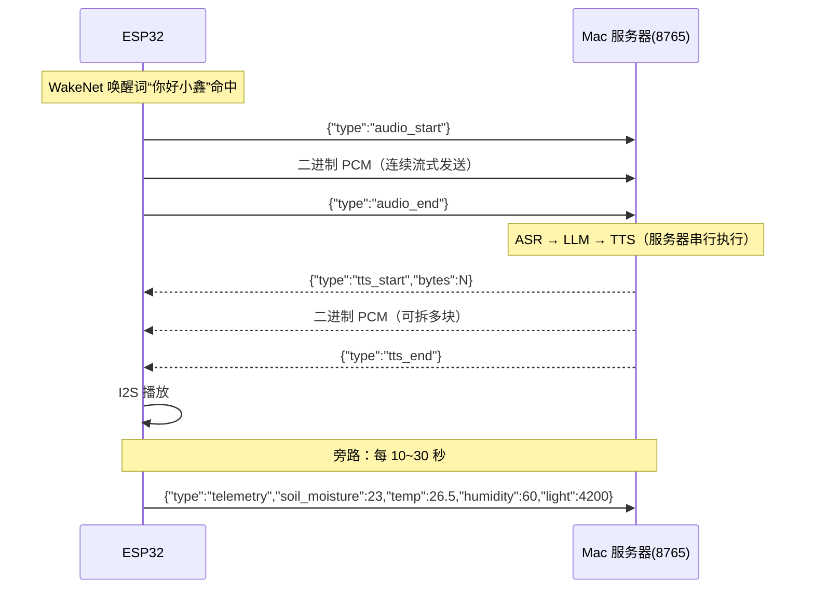
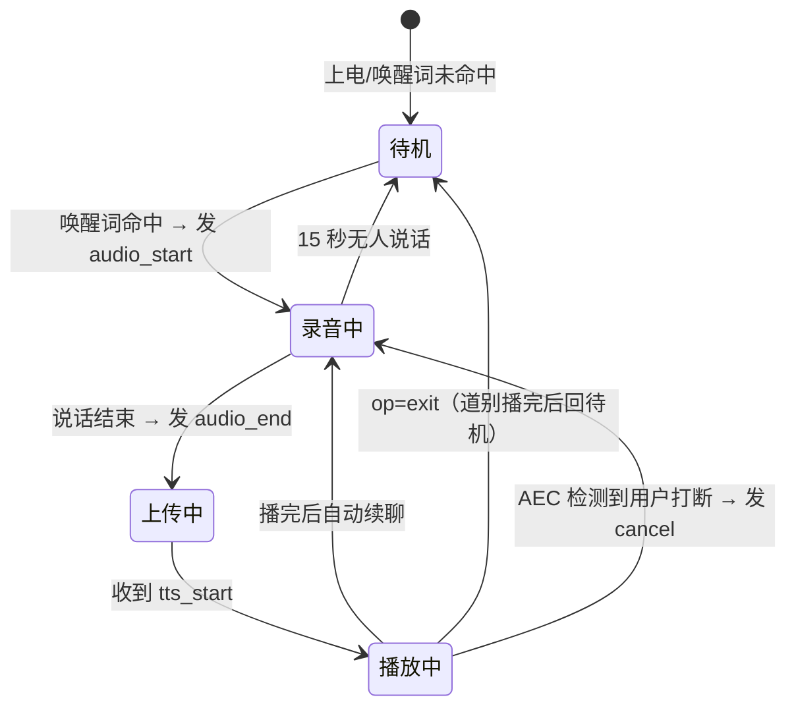

# Viora ESP32 客户端接入文档

> 本文档面向 **ESP32 端**项目，说明如何接入 Mac 上的 Viora 服务器。
>
> ESP32 端职责（只做这四件事）：
> 1. **唤醒词检测**（ESP-SR WakeNet 内置模型，"nihaoxiaoxin（你好小鑫）"）
> 2. **录音上传**（16k/16bit PCM，经 WebSocket）
> 3. **接收音频播放**（服务器下发的合成语音）
> 4. **传感器采集上报**（土壤湿度 / 温湿度 / 光照）
>
> 所有语音理解、对话、合成都在 Mac 服务器端完成，ESP32 不跑 ASR/LLM/TTS。

---

## 0. 软件模块结构

固件按功能拆成独立模块，**修改硬件只改 `src/hardware/hardware_config.h`**：

```
src/
├── main.cpp                  # 对话状态机编排（IDLE→LISTENING→PROCESSING→PLAYING）
├── config.h                  # 全局配置（含 hardware_config.h）
├── hardware/
│   └── hardware_config.h     # ⭐ 所有 GPIO/总线定义集中在这里
├── sensor/
│   ├── sensor_manager.h      # SensorManager：板载 SHTC3 + 可选 BH1750 + 土壤湿度
│   └── sensor_manager.cpp
├── audio/
│   ├── audio_manager.h       # AudioManager：ES7210 + ES8311（共享 I2S 全双工）
│   └── audio_manager.cpp
├── ai/
│   ├── wake_word.h           # WakeWordManager 兼容接口（独立 VAD；唤醒由 AFE WakeNet 返回）
│   ├── wake_word.cpp
│   ├── ai_manager.h          # AIManager 接口预留（Mic→WakeWord→ASR→LLM→TTS→播放，mock）
│   └── ai_manager.cpp
├── net.cpp / provisioning.*  # WiFi 配网 + WebSocket 上传/接收
├── speech.*                  # esp-sr AFE（AEC + 神经 VAD + WakeNet 9）
├── turn_detector.* / vad.*   # 轮次状态机 / 能量 VAD
└── led.* / wake_ack_data.*   # 状态灯 / 本地确认音
```

> 旧的 `src/audio.cpp` 与 `src/wake_word.cpp` 已由
> `src/audio/audio_manager.cpp`、`src/ai/wake_word.cpp` 取代，在
> `platformio.ini` 的 `build_src_filter` 中排除编译（保留在磁盘上，确认
> 无误后可自行删除）。

### 需要安装的库

已在 `platformio.ini` 的 `lib_deps` 中声明，`platformio run` 会自动下载：

| 库 | 用途 |
|----|------|
| `claws/BH1750` | BH1750 光照（I2C，GY-302） |
| `links2004/WebSockets` | WebSocket 客户端（连接 VioraServer） |
| `bblanchon/ArduinoJson` | JSON 控制帧解析 |

ESP-IDF 组件（本地 `components/`，`scripts/fetch_components.py` 拉取）：
`esp-sr`（AFE/神经 VAD/独立 VAD/WakeNet 9）、`esp-dsp`、`esp-nn`。
传感器使用 Arduino 库，无需额外 ESP-IDF 组件。

---

## 1. 整体链路



---

## 2. 硬件选型建议

| 模块 | 推荐型号 | 说明 |
|------|----------|------|
| 主控 | Waveshare ESP32-S3-RLCD-4.2 | N16R8，板载 RLCD 与音频 Codec |
| 麦克风 | 板载双麦 + ES7210 | 16kHz、16bit 双声道 I2S，固件取 MIC1 |
| 功放+扬声器 | 板载 ES8311 + NS4150B | 接板载 2Pin 扬声器座 |
| 人体存在 | HLK-LD2410S | 3.3V 供电；OT1/RX/OT2 接 GPIO1/2/3 |
| 土壤湿度 | 电容式土壤湿度传感器 | 当前停用，GPIO1 已让给 LD2410S |
| 温湿度 | 板载 SHTC3 | I2C 地址 0x70 |
| 光照 | GY-302（BH1750，可选外接） | 与板载设备共享 I2C |

### 实际引脚连接（固定映射，与 `src/hardware/hardware_config.h` 一致）

> 所有引脚集中定义在 `src/hardware/hardware_config.h`，修改硬件只改这一个文件。

| 外设 | 信号 | 引脚 | 说明 |
|------|------|------|------|
| 板载/扩展 I2C | SDA | GPIO 13 | SHTC3、Codec 与扩展排针共享 |
| 板载/扩展 I2C | SCL | GPIO 14 | 400kHz，板载已有上拉 |
| LD2410S | OT1 / UART TX | GPIO 1 | 接 ESP32 RX |
| LD2410S | RX / UART RX | GPIO 2 | 接 ESP32 TX |
| LD2410S | OT2 / 存在输出 | GPIO 3 | 高电平有人、低电平无人 |
| 土壤湿度 | AOUT | — | 当前由 `ENABLE_SOIL_SENSOR=0` 停用 |
| 对话取消 / 固件更新键 | 板载 KEY | GPIO 18 | 对话中按下立即退出；待机时用于查看、下载和安装更新 |
| ES7210/ES8311 | MCLK | GPIO 16 | 4.096MHz |
| ES7210/ES8311 | BCLK | GPIO 9 | 共享音频时钟 |
| ES7210/ES8311 | WS | GPIO 45 | 共享左右声道时钟 |
| ES7210 | ASDOUT | GPIO 10 | 双麦录音输入 |
| ES8311 | DSDIN | GPIO 8 | 扬声器播放输出 |
| NS4150B 功放 | PA EN | GPIO 46 | Codec 初始化成功后拉高 |

> 板载 SHTC3 与 ESP32、Codec 和电源电路共板，会受 PCB 热传导影响。
> 固件针对 Wi-Fi 与语音常开的工作负载应用 `-6.0°C` 经验补偿，并按
> Sensirion 水汽压公式同步修正相对湿度；每 30 秒以低功耗模式测量一次。
> 串口会同时打印 SHTC3 原始值与补偿值，最终可配合同位置的可靠温度计在
> `src/hardware/hardware_config.h` 中微调偏移。

> 屏幕固定占用 GPIO5/6/11/12/40/41；GPIO4 是板载电池电压检测，均不可再
> 分配给传感器或音频。此板没有可编程 WS2812 状态灯。

---

## 2.1 接线验证方法

烧录后打开串口监视器（115200），应看到启动横幅：

```text
========== Vesper Hardware ==========
ESP32-S3 Ready
I2C:
SDA GPIO13
SCL GPIO14
I2S:
BCLK GPIO9
WS GPIO45
Sensors:
SHTC3 OK
BH1750 OK
Soil ADC DISABLED (GPIO1 -> LD2410S OT1)
LD2410S UART GPIO1/2 OT2 GPIO3
Audio:
ES7210 dual MIC OK
ES8311 speaker OK
=====================================
```

按顺序排查：

1. **传感器（I2C）**：板载 `SHTC3` 应显示 `OK`；外接 `BH1750` 未连接时
   显示 `FAIL` 属正常。扩展 I2C 使用 SDA=GPIO13、SCL=GPIO14。随后每 5 秒打印一行
   `[SENSOR] temp=..C hum=..% light=..lx soil=..% (raw=..)`。
2. **LD2410S**：有人进入应打印 `[PRESENCE] 有人进入，距离=...cm`，离开并
   持续 20 秒后打印 `[PRESENCE] 已确认无人`。UART 超过 3 秒无有效帧时自动
   回退到 OT2，因此即使距离暂不可用仍能判断有人/无人。待机页右上角仅在
   有人时显示一个小型线稿人物图标，不显示文字或距离。
3. **麦克风（ES7210）**：板载双麦无需外接线。正常说话时 `[HEALTH]`
   日志的 `mic_peak`/`mic_rms` 会明显抬升
   （`config.h` 的 `ENABLE_HEALTH_LOG` 设为 1 开启）。
4. **喇叭（ES8311）**：将随板喇叭插入 2Pin 扬声器座。对设备说唤醒词
   “你好小鑫”，应听到确认音/回复。
5. **无线对话**：连上 VioraServer 后说“你好小鑫”+指令，走完整
   麦克风→唤醒→上传→ASR→LLM→TTS→播放 链路。

> 排查时若 `Audio` 报 `FAIL`，`[AUDIO] I2S init failed` 会打印具体错误码
> （ESP_ERR_*）。

---

## 3. 通信协议（重要，必须严格遵守）

- 端点：`ws://<Mac IP>:8765/ws`
- 音频规格：**16kHz / 16bit / 单声道 / little-endian PCM**，每样本 2 字节。
- 帧分两类：**文本帧 = JSON 控制消息**，**二进制帧 = 音频数据**。

### 3.1 ESP32 → 服务器

| 帧类型 | 内容 | 说明 |
|--------|------|------|
| 文本 | `{"type":"audio_start","source":"wake","new_conversation":true}` | 开始上传；唤醒轮会重置旧上下文，追问轮用 `follow_up` |
| 二进制 | PCM 字节 | 音频数据，可拆成多块连续发送 |
| 文本 | `{"type":"audio_end","trim_start_ms":300,"trim_end_ms":650}` | 动态断句完成；首尾裁剪提示可减少 ASR 延迟 |
| 文本 | `{"type":"cancel","reason":"barge_in"}` | 用户在回复播放中打断，立即取消当前回复 |
| 文本 | `{"type":"telemetry","temp":26.5,"presence":true,"presence_distance_cm":126}` | 传感器与人在状态快照 |
| 文本 | `{"type":"proactive_call","reason":"presence_return","distance_cm":126}` | 久别后靠近且通过冷却/夜间规则时请求主动问候 |

### 3.2 服务器 → ESP32

| 帧类型 | 内容 | 说明 |
|--------|------|------|
| 文本 | `{"type":"text","user":"...","reply":"...","op":"none"}` | 回复文字；`op` 为 LLM 识别操作：`none`/`exit`/`volume_up`/`volume_down` |
| 文本 | `{"type":"tts_start","bytes":N}` | 开始下发合成音频，N 为 PCM 总字节数 |
| 二进制 | PCM 字节 | 合成音频，可拆成多块 |
| 文本 | `{"type":"tts_end"}` | 音频结束，完成播放 |
| 文本 | `{"type":"cmd","action":"pump","seconds":3}` | 控制指令（可选，二期） |
| 文本 | `{"type":"error","message":"..."}` | 出错提示 |

### 3.3 状态机约定

- 服务器收到 `audio_start` 后进入"收音频"状态，把后续二进制帧拼进缓冲区，直到 `audio_end`。
- 收到 `audio_end` 后服务器串行执行 ASR → LLM → TTS，**期间忙**：此时再发 `audio_start` 会收到 `{"type":"error","message":"服务器忙..."}`。
- 流水线完成后服务器先发 `tts_start`，再流式发二进制音频，最后 `tts_end`。
- text 帧带 `op` 字段，端侧按 op 分发：`exit`→道别音频播完回待唤醒；`volume_up`/`volume_down`→调播放音量；其余忽略。

**ESP32 端对应状态机：**



### 3.4 自然轮次策略

- 唤醒与打断都保留约 900ms 前置音频，避免 KWS/VAD 的固有延迟截掉首字。
- 连续约 96ms 人声才确认开口；短回答最多等 1.2s，正常句约 0.85s，长句约 0.75s 静音即回复。
- 用户在同一句中停顿后继续说时，设备学习本轮节奏，自动把后续等待放宽，最大 1.8s。
- 回复播放完立即回到聆听；15s 没有新话题才结束会话。播放中经 AEC 后连续约 160ms 检出近端人声即可打断。
- 人在状态需连续有人约 0.8 秒才进入，连续无人 20 秒才离开；离开至少 5 分钟、
  回来后进入 1.8 米并停留 3 秒才允许主动问候。主动问候每 4 小时最多一次，
  23:00～07:00 静音，且仅在设备待机、联网、未 OTA 时触发。
- TTS 采用两级抖动缓冲：服务端先累积约 750ms PCM，设备收到约
  384ms 后开播；若播放中仍发生欠载，累积约 512ms 后再续播，避免
  Qwen 云端回调或局域网抖动变成反复爆音。
- 扬声器由独立 FreeRTOS 任务持续喂入约 192ms I2S DMA，不再依赖主循环
  每 32ms 恰好运行一次；AEC 参考另按播放顺序排队，识别计算偶发变慢也
  不会把应用缓冲仍充足的 TTS 播成沙沙断音。

ESP32-S3-RLCD-4.2 没有可编程 RGB 状态灯，因此 `led.*` 在该板型上自动
使用空实现；后续可将这些状态接入 RLCD 界面。

---

## 4. 开发环境

推荐 **PlatformIO**（VSCode 插件），依赖管理比 Arduino IDE 方便。

### `platformio.ini` 示例

```ini
[env:waveshare-esp32-s3-rlcd-42]
platform = espressif32
board = waveshare-esp32-s3-rlcd-42
framework = arduino
monitor_speed = 115200

lib_deps =
    links2004/WebSockets@^2.4.1
    adafruit/DHT sensor library@^1.4.6
    adafruit/Adafruit Unified Sensor@^1.1.14
    ; 音频 I2S 可选用 schreibfaul1/ESP32-audioI2S，或用 arduino-esp32 自带 I2S 驱动
```

### 关键库

| 库 | 用途 |
|----|------|
| `links2004/WebSockets` | WebSocket 客户端 |
| `arduino-esp32` 自带 I2S | 录音 / 播放（`driver/i2s.h`） |
| `schreibfaul1/ESP32-audioI2S` | （可选）封装好的 I2S 输入输出 |
| `DHT sensor library` | 温湿度 |
| ESP-SR（ESP-IDF 组件） | 神经 VAD + 降噪（AFE，见 §7） |
| ESP-SR + ESP-NN | AFE、神经 VAD 与 WakeNet 9 推理 |

---

## 5. 目录结构建议

```
viora-esp32/
├── platformio.ini
├── README.md              # 本文件
├── include/
│   └── config.h           # WiFi / 服务器地址 / 引脚
└── src/
    ├── main.cpp           # 主流程 + 状态机
    ├── ws_client.cpp      # WebSocket 收发
    ├── mic.cpp            # I2S 录音
    ├── speaker.cpp        # I2S 播放
    ├── wake_word.cpp      # 唤醒词检测
    └── sensors.cpp        # 传感器采集
```

### 敏感配置（`src/secrets.h`）

WiFi、服务器域名/端口、API Key 属于敏感信息，不会提交到 GitHub：

```bash
cp src/secrets.example.h src/secrets.h   # 复制模板后填写
```

`secrets.h` 内容（已被 `.gitignore` 忽略）：

```cpp
#define SECRET_WIFI_SSID    "你的WiFi名"
#define SECRET_WIFI_PASS    "你的WiFi密码"
#define SECRET_SERVER_HOST  "your-server-host"   // 域名需局域网 DNS 能解析，或直接填 IP
#define SECRET_SERVER_PORT  8765
#define SECRET_API_KEY      "与 VioraServer/.env 的 API_KEY 一致"
```

固件握手时携带 `X-Api-Key` 请求头，服务端校验失败会拒绝连接（close 1008）。
服务端 `.env` 里 `API_KEY` 留空则鉴权关闭（开发模式）。其余公开参数（引脚、
VAD、唤醒词等）仍在 `src/config.h`。
#define AUDIO_BITS         I2S_DATA_BIT_WIDTH_16BIT
#define AUDIO_CHANNELS     I2S_CHANNEL_FMT_ONLY_LEFT

// I2S 录音（INMP441）
#define I2S_MIC_BCLK   4
#define I2S_MIC_WS     5
#define I2S_MIC_DIN    6

// I2S 播放（MAX98357A）
#define I2S_SPK_BCLK  15
#define I2S_SPK_LRC   16
#define I2S_SPK_DOUT  17

// 传感器
#define DHT_PIN        8
#define SOIL_ADC_PIN   2

// 遥测上报周期（毫秒）
#define TELEMETRY_INTERVAL_MS 15000
```

---

## 6. 核心接入代码示例

下面是接入服务器的**最小可用示例**，录音/播放/唤醒词用接口函数占位，按你的硬件实现即可。

```cpp
#include <Arduino.h>
#include <WiFi.h>
#include <WebSocketsClient.h>
#include <ArduinoJson.h>
#include "config.h"

// ---------- 音频接口（按你的硬件实现） ----------
bool mic_begin();                    // 初始化 I2S 麦克风
bool speaker_begin();                // 初始化 I2S 功放
int  mic_read(int16_t* buf, int samples);   // 读一帧 PCM，返回样本数
void speaker_play(const uint8_t* data, size_t len); // 播放一段 PCM
bool wake_word_detected();           // AFE WakeNet 是否命中“你好小鑫”

WebSocketsClient ws;
bool collecting = false;             // 是否处于"录音上传"状态
uint32_t lastTelemetry = 0;

void sendJson(const char* type) {
  StaticJsonDocument<128> doc;
  doc["type"] = type;
  char buf[128];
  serializeJson(doc, buf);
  ws.sendTXT(buf);
}

void sendTelemetry() {
  StaticJsonDocument<256> doc;
  doc["type"] = "telemetry";
  doc["soil_moisture"] = 23;   // TODO: 换成真实传感器读数
  doc["temp"] = 26.5;
  doc["humidity"] = 60;
  doc["light"] = 4200;
  char buf[256];
  serializeJson(doc, buf);
  ws.sendTXT(buf);
}

// WebSocket 事件回调
void onWsEvent(WStype_t type, uint8_t* payload, size_t len) {
  switch (type) {
    case WStype_CONNECTED:
      Serial.printf("[ws] 已连接 %s:%d\n", SERVER_IP, SERVER_PORT);
      break;

    case WStype_TEXT: {
      StaticJsonDocument<256> doc;
      DeserializationError err = deserializeJson(doc, payload, len);
      if (err) return;
      const char* t = doc["type"];
      if (strcmp(t, "tts_start") == 0) {
        // 准备播放：可初始化播放缓冲，bytes = doc["bytes"]
        Serial.printf("[ws] 开始播放，共 %d 字节\n", (int)doc["bytes"]);
      } else if (strcmp(t, "tts_end") == 0) {
        Serial.println("[ws] 播放结束");
      } else if (strcmp(t, "error") == 0) {
        Serial.printf("[ws] 服务器错误: %s\n", (const char*)doc["message"]);
        collecting = false;   // 出错则复位状态
      }
      break;
    }

    case WStype_BIN:
      // 服务器下发的合成语音 PCM → 直接送去播放
      speaker_play(payload, len);
      break;

    case WStype_DISCONNECTED:
      Serial.println("[ws] 断开，稍后重连");
      break;
  }
}

void setup() {
  Serial.begin(115200);
  WiFi.begin(WIFI_SSID, WIFI_PASSWORD);
  while (WiFi.status() != WL_CONNECTED) {
    delay(500);
    Serial.print(".");
  }
  Serial.println("\nWiFi 已连接");

  mic_begin();
  speaker_begin();

  ws.begin(SERVER_IP, SERVER_PORT, WS_PATH);
  ws.onEvent(onWsEvent);
  ws.setReconnectInterval(3000);
}

void loop() {
  ws.loop();

  if (!ws.isConnected()) return;

  // 唤醒词命中 → 开始录音上传
  if (!collecting && wake_word_detected()) {
    collecting = true;
    sendJson("audio_start");
    Serial.println("[app] 开始录音上传");
  }

  // 录音中 → 分块上传 PCM
  if (collecting) {
    const int FRAME_SAMPLES = 1600;              // 每块 100ms
    int16_t buf[FRAME_SAMPLES];
    int n = mic_read(buf, FRAME_SAMPLES);
    if (n > 0) {
      ws.sendBIN((uint8_t*)buf, n * 2);          // 16bit → 2 字节/样本
    }
    // TODO: 用 VAD/静音检测判断说完话，这里以固定时长为例
    static uint32_t recStart = millis();
    if (millis() - recStart > 5000) {            // 最长录 5 秒
      collecting = false;
      sendJson("audio_end");
      Serial.println("[app] 录音结束，等待服务器回复");
    }
  }

  // 定时上报遥测
  if (millis() - lastTelemetry > TELEMETRY_INTERVAL_MS) {
    lastTelemetry = millis();
    sendTelemetry();
  }
}
```

> 关键点：`mic_read` 必须输出 **16k/16bit/单声道/小端** 的 PCM，`ws.sendBIN` 直接把 `int16_t` 数组按字节发送即可（小端平台无需转换）。

---

## 7. 唤醒词检测 + 断句 VAD

项目使用同一条 ESP-SR AFE 连续音频流完成唤醒和对话前端：

- **唤醒词**：使用 Espressif 官方 `wn9_nihaoxiaoxin_tts`，口令为“你好小鑫”，
  不需要自行训练。`scripts/package_wakenet_model.py` 在构建时把模型打包成
  `srmodels.bin`，并写入分区表中的 `model` 分区（偏移 `0x810000`）。
- **连续流要求**：AFE 的 feed 与 fetch 分属两个 FreeRTOS 任务。WakeNet 约需
  1.5 秒感受野；不能在喂一帧后由同一任务阻塞等待 fetch，否则会超时且永不命中。
- **增益**：采用 ESP-SR 默认的 `AFE_MN_PEAK_AGC_MODE_2`，补偿板载麦克风在
  不同说话距离下的电平变化。
- **断句端点**：AFE 内置**神经 VAD**（`vad_state`）判断“是否有人说话”，替代能量门限——背景音乐不会被当成人声，音乐播放中也能正确结束对话；能量法（`vad.*`）仅留作诊断。
- **降噪**：AFE 输出增强音频（NS_MODE_SSP），上传给服务器 Whisper 的也是增强后的 PCM。
- **WakeNet**：启用 `wn9_nihaoxiaoxin_tts`。AFE 配置为单麦 + 扬声器参考通道，
  开启 AEC，并优先把工作内存放入 PSRAM。

> 注意：`src/esp_afe_sr_1mic.ref` 是新版本模板，与 1.9.2 头文件不兼容，不要编译；直接用 `esp_afe_sr_models.h` 里的 `ESP_AFE_SR_HANDLE.create_from_config()`。

> 当前 `srmodels.bin` 约 284 KB。PlatformIO 上传固件时会自动检查并烧录
> `0x810000` 的 model 分区；模型、开发环境或串口变化时会重新烧录。
> 如需强制重刷，可在上传时设置 `FORCE_MODEL_FLASH=1`。

---

## 8. 传感器上报

`telemetry` 字段与服务器提示词严格对应：

| 字段 | 含义 | 单位 |
|------|------|------|
| `soil_moisture` | 土壤湿度 | %（<30 偏干） |
| `temp` | 气温 | ℃ |
| `humidity` | 空气湿度 | % |
| `light` | 光照 | lux |

每 10~30 秒上报一次即可，服务器只保留最新快照并注入 LLM 提示词。

---

## 9. 调试清单

1. **连不上**：确认 ESP32 与 Mac 同一局域网；Mac 上服务器已启动（`curl http://<Mac IP>:8765/health` 应返回 `{"service":"Viora","status":"ok"}`）。
2. **收到 `{"type":"error","message":"服务器忙..."}`**：上一轮流水线还没结束，等收到 `tts_end` 后再发下一段语音。
3. **上传后无回复**：检查麦克风采样率是否为 16k、位深 16bit、单声道；打印 `mic_read` 读到的样本数确认非 0。
4. **播放声音小/杂音**：确认喇叭插头已插紧，并查看启动日志中 ES8311 与 PA 是否均为 `OK/ON`。

---

## 10. 与服务器端接口速查

| 项 | 约定 |
|----|------|
| 端点 | `ws://<Mac IP>:8765/ws` |
| 采样率 | 16000 Hz |
| 位深 | 16 bit |
| 声道 | 单声道 |
| 字节序 | little-endian |
| 上行开始/结束 | `audio_start` / `audio_end` |
| 下行开始/结束 | `tts_start` / `tts_end` |
| 传感器上报 | `telemetry` |

---

## 11. 出门在外换 WiFi（手机配网，无需电脑）

固件内置**兜底配网热点**：WiFi 连续 `PROV_TIMEOUT_MS`（90 秒）连不上时，设备自动开启
热点 **`Viora-Setup`**（密码 `viora1234`），用手机即可完成配网。

### 使用步骤（iPhone / 任何手机通用）

1. 给设备上电，等约 90 秒，直到状态灯变为**白色脉冲**（或手机 WiFi 列表里出现 `Viora-Setup`）。
2. 手机 WiFi 设置里连接 `Viora-Setup`，密码 `viora1234`。
3. 连接后一般会自动弹出配网页；没弹出就用浏览器访问 `192.168.4.1`。
4. 填写新 WiFi 的名称和密码 → **保存并重启**。
5. 设备自动重启并连接新网络；连接成功后热点自动关闭，状态灯回到蓝色呼吸。

### 机制说明

- 配网保存的网络写入 **NVS（掉电不丢）**，最多保存 `PROV_MAX_NETWORKS`（4）个，新保存的优先尝试。
- 连接网络时按 **NVS 保存列表 → `secrets.h` 默认网络** 的顺序轮询，每个网络尝试 `WIFI_ATTEMPT_MS`（8 秒）。
- 以后换地方：所有候选都失败 90 秒后自动再次进入配网模式，重复上面的步骤即可。
- 配网页里可以删除不再使用的已保存网络。

> 相关配置（热点名/密码/超时等）都在 `src/config.h` 的 `PROV_*` / `WIFI_ATTEMPT_MS` 宏里。
> 注意：服务器域名 `sinscry.synology.me:11451` 走公网时需要路由器端口转发；配好 WiFi 后若连不上服务器，先检查端口转发。
