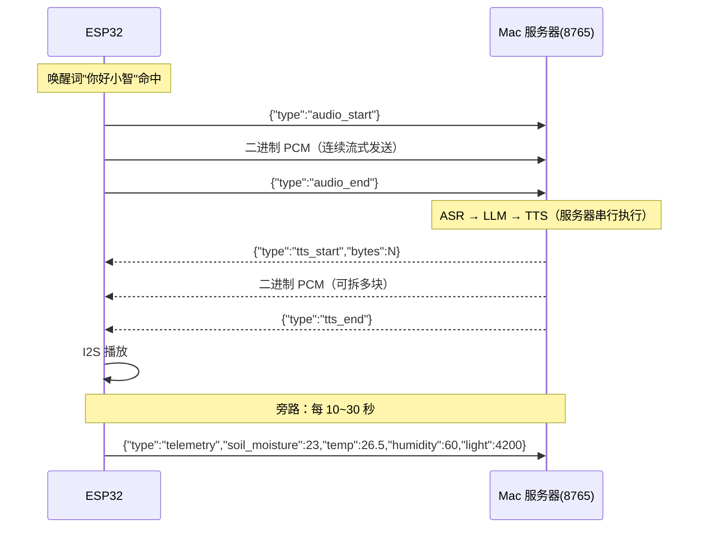
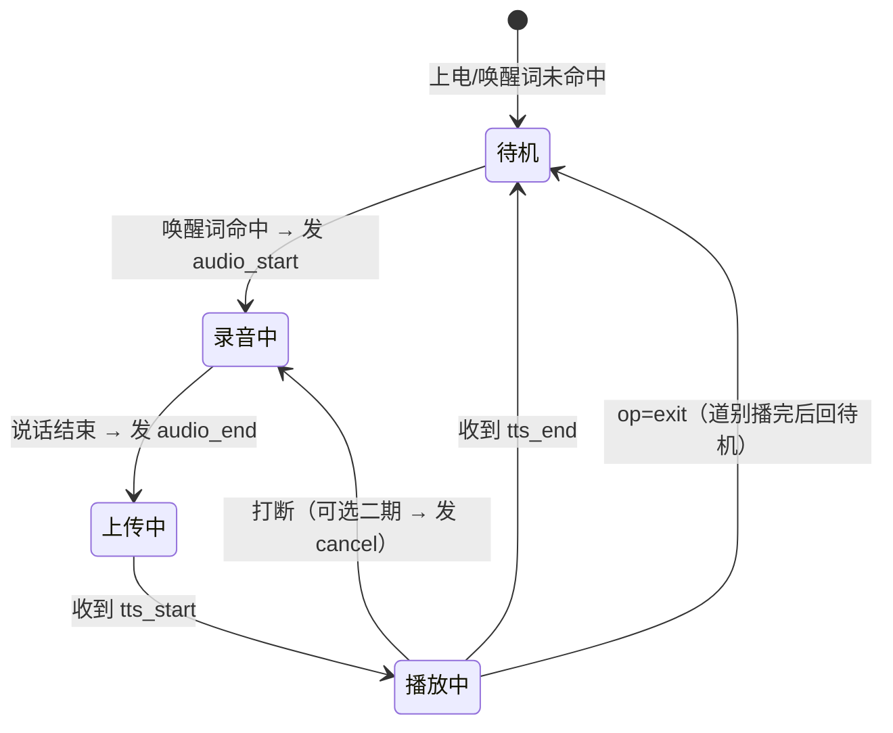

# PlantTalk ESP32 客户端接入文档

> 本文档面向 **ESP32 端**项目，说明如何接入 Mac 上的 PlantTalk 服务器。
>
> ESP32 端职责（只做这四件事）：
> 1. **唤醒词检测**（"你好小智"）
> 2. **录音上传**（16k/16bit PCM，经 WebSocket）
> 3. **接收音频播放**（服务器下发的合成语音）
> 4. **传感器采集上报**（土壤湿度 / 温湿度 / 光照）
>
> 所有语音理解、对话、合成都在 Mac 服务器端完成，ESP32 不跑 ASR/LLM/TTS。

---

## 1. 整体链路



---

## 2. 硬件选型建议

| 模块 | 推荐型号 | 说明 |
|------|----------|------|
| 主控 | ESP32-S3-WROOM-1（N16R8） | 带向量指令，跑唤醒词更省力；I2S 外设全 |
| 麦克风 | INMP441 | I2S MEMS 数字麦克风，输出 24bit（取高 16bit） |
| 功放+扬声器 | MAX98357A + 3W 小喇叭 | I2S DAC 功放，单声道 |
| 土壤湿度 | 电容式土壤湿度传感器 | 比电阻式耐腐蚀 |
| 温湿度 | DHT22 / SHT30 | I2C 或单总线 |
| 光照 | BH1750 或光敏电阻 | I2C / ADC |

### 推荐引脚连接（以 ESP32-S3 为例）

| 外设 | 引脚 | 说明 |
|------|------|------|
| INMP441 SCK | GPIO 4 | I2S BCLK |
| INMP441 WS | GPIO 5 | I2S LRCK |
| INMP441 SD | GPIO 6 | I2S DIN |
| MAX98357A BCLK | GPIO 15 | I2S BCLK |
| MAX98357A LRC | GPIO 16 | I2S LRCK |
| MAX98357A DIN | GPIO 17 | I2S DOUT |
| DHT22 DATA | GPIO 8 | 单总线 |
| BH1750 SDA/SCL | GPIO 11 / 12 | I2C |
| 土壤湿度 AO | GPIO 2 | ADC |

> 引脚可按实际板子调整，只需在 `config.h` 里改。

---

## 3. 通信协议（重要，必须严格遵守）

- 端点：`ws://<Mac IP>:8765/ws`
- 音频规格：**16kHz / 16bit / 单声道 / little-endian PCM**，每样本 2 字节。
- 帧分两类：**文本帧 = JSON 控制消息**，**二进制帧 = 音频数据**。

### 3.1 ESP32 → 服务器

| 帧类型 | 内容 | 说明 |
|--------|------|------|
| 文本 | `{"type":"audio_start"}` | 开始上传一段用户语音 |
| 二进制 | PCM 字节 | 音频数据，可拆成多块连续发送 |
| 文本 | `{"type":"audio_end"}` | 语音结束，触发服务器 ASR→LLM→TTS |
| 文本 | `{"type":"telemetry","soil_moisture":23,"temp":26.5,"humidity":60,"light":4200}` | 传感器快照 |

### 3.2 服务器 → ESP32

| 帧类型 | 内容 | 说明 |
|--------|------|------|
| 文本 | `{"type":"text","user":"...","reply":"...","op":"none"}` | 回复文字；`op` 为 LLM 识别操作：`none`/`exit`/`volume_up`/`volume_down` |
| 文本 | `{"type":"tts_start","bytes":N}` | 开始下发合成音频，N 为 PCM 总字节数 |
| 二进制 | PCM 字节 | 合成音频，可拆成多块 |
| 文本 | `{"type":"tts_end"}` | 音频结束，完成播放 |
| 文本 | `{"type":"cmd","action":"pump","seconds":3}` | 控制指令（可选，二期） |
| 文本 | `{"type":"error","message":"..."}` | 出错提示 |

### 3.3 状态机约定

- 服务器收到 `audio_start` 后进入"收音频"状态，把后续二进制帧拼进缓冲区，直到 `audio_end`。
- 收到 `audio_end` 后服务器串行执行 ASR → LLM → TTS，**期间忙**：此时再发 `audio_start` 会收到 `{"type":"error","message":"服务器忙..."}`。
- 流水线完成后服务器先发 `tts_start`，再流式发二进制音频，最后 `tts_end`。
- text 帧带 `op` 字段，端侧按 op 分发：`exit`→道别音频播完回待唤醒；`volume_up`/`volume_down`→调播放音量；其余忽略。

**ESP32 端对应状态机：**



**板载状态灯（WS2812 RGB，GPIO48，`led.*` 已实现）**：

| 灯色 | 状态 |
|------|------|
| 红闪 | 未连接服务器 |
| 蓝呼吸 | 待唤醒（IDLE） |
| 绿常亮 | 聆听中 |
| 琥珀呼吸 | 等服务器处理 |
| 青常亮 | 播放回复 |

---

## 4. 开发环境

推荐 **PlatformIO**（VSCode 插件），依赖管理比 Arduino IDE 方便。

### `platformio.ini` 示例

```ini
[env:esp32s3]
platform = espressif32
board = esp32-s3-devkitc-1
framework = arduino
monitor_speed = 115200

lib_deps =
    links2004/WebSockets@^2.4.1
    adafruit/DHT sensor library@^1.4.6
    adafruit/Adafruit Unified Sensor@^1.1.14
    ; 音频 I2S 可选用 schreibfaul1/ESP32-audioI2S，或用 arduino-esp32 自带 I2S 驱动
```

### 关键库

| 库 | 用途 |
|----|------|
| `links2004/WebSockets` | WebSocket 客户端 |
| `arduino-esp32` 自带 I2S | 录音 / 播放（`driver/i2s.h`） |
| `schreibfaul1/ESP32-audioI2S` | （可选）封装好的 I2S 输入输出 |
| `DHT sensor library` | 温湿度 |
| ESP-SR（ESP-IDF 组件） | 唤醒词 + 神经 VAD + 降噪（AFE，见 §7） |

---

## 5. 目录结构建议

```
planttalk-esp32/
├── platformio.ini
├── README.md              # 本文件
├── include/
│   └── config.h           # WiFi / 服务器地址 / 引脚
└── src/
    ├── main.cpp           # 主流程 + 状态机
    ├── ws_client.cpp      # WebSocket 收发
    ├── mic.cpp            # I2S 录音
    ├── speaker.cpp        # I2S 播放
    ├── wake_word.cpp      # 唤醒词检测
    └── sensors.cpp        # 传感器采集
```

### `include/config.h`

```cpp
#pragma once

// WiFi
#define WIFI_SSID     "你的WiFi名"
#define WIFI_PASSWORD "你的WiFi密码"

// 服务器（Mac 局域网 IP + 端口）
#define SERVER_IP     "CHANGED-SERVER-IP"
#define SERVER_PORT   8765
#define WS_PATH       "/ws"

// 音频规格（与服务器一致，勿改）
#define AUDIO_SAMPLE_RATE  16000
#define AUDIO_BITS         I2S_DATA_BIT_WIDTH_16BIT
#define AUDIO_CHANNELS     I2S_CHANNEL_FMT_ONLY_LEFT

// I2S 录音（INMP441）
#define I2S_MIC_BCLK   4
#define I2S_MIC_WS     5
#define I2S_MIC_DIN    6

// I2S 播放（MAX98357A）
#define I2S_SPK_BCLK  15
#define I2S_SPK_LRC   16
#define I2S_SPK_DOUT  17

// 传感器
#define DHT_PIN        8
#define SOIL_ADC_PIN   2

// 遥测上报周期（毫秒）
#define TELEMETRY_INTERVAL_MS 15000
```

---

## 6. 核心接入代码示例

下面是接入服务器的**最小可用示例**，录音/播放/唤醒词用接口函数占位，按你的硬件实现即可。

```cpp
#include <Arduino.h>
#include <WiFi.h>
#include <WebSocketsClient.h>
#include <ArduinoJson.h>
#include "config.h"

// ---------- 音频接口（按你的硬件实现） ----------
bool mic_begin();                    // 初始化 I2S 麦克风
bool speaker_begin();                // 初始化 I2S 功放
int  mic_read(int16_t* buf, int samples);   // 读一帧 PCM，返回样本数
void speaker_play(const uint8_t* data, size_t len); // 播放一段 PCM
bool wake_word_detected();           // 唤醒词"你好小智"是否命中

WebSocketsClient ws;
bool collecting = false;             // 是否处于"录音上传"状态
uint32_t lastTelemetry = 0;

void sendJson(const char* type) {
  StaticJsonDocument<128> doc;
  doc["type"] = type;
  char buf[128];
  serializeJson(doc, buf);
  ws.sendTXT(buf);
}

void sendTelemetry() {
  StaticJsonDocument<256> doc;
  doc["type"] = "telemetry";
  doc["soil_moisture"] = 23;   // TODO: 换成真实传感器读数
  doc["temp"] = 26.5;
  doc["humidity"] = 60;
  doc["light"] = 4200;
  char buf[256];
  serializeJson(doc, buf);
  ws.sendTXT(buf);
}

// WebSocket 事件回调
void onWsEvent(WStype_t type, uint8_t* payload, size_t len) {
  switch (type) {
    case WStype_CONNECTED:
      Serial.printf("[ws] 已连接 %s:%d\n", SERVER_IP, SERVER_PORT);
      break;

    case WStype_TEXT: {
      StaticJsonDocument<256> doc;
      DeserializationError err = deserializeJson(doc, payload, len);
      if (err) return;
      const char* t = doc["type"];
      if (strcmp(t, "tts_start") == 0) {
        // 准备播放：可初始化播放缓冲，bytes = doc["bytes"]
        Serial.printf("[ws] 开始播放，共 %d 字节\n", (int)doc["bytes"]);
      } else if (strcmp(t, "tts_end") == 0) {
        Serial.println("[ws] 播放结束");
      } else if (strcmp(t, "error") == 0) {
        Serial.printf("[ws] 服务器错误: %s\n", (const char*)doc["message"]);
        collecting = false;   // 出错则复位状态
      }
      break;
    }

    case WStype_BIN:
      // 服务器下发的合成语音 PCM → 直接送去播放
      speaker_play(payload, len);
      break;

    case WStype_DISCONNECTED:
      Serial.println("[ws] 断开，稍后重连");
      break;
  }
}

void setup() {
  Serial.begin(115200);
  WiFi.begin(WIFI_SSID, WIFI_PASSWORD);
  while (WiFi.status() != WL_CONNECTED) {
    delay(500);
    Serial.print(".");
  }
  Serial.println("\nWiFi 已连接");

  mic_begin();
  speaker_begin();

  ws.begin(SERVER_IP, SERVER_PORT, WS_PATH);
  ws.onEvent(onWsEvent);
  ws.setReconnectInterval(3000);
}

void loop() {
  ws.loop();

  if (!ws.isConnected()) return;

  // 唤醒词命中 → 开始录音上传
  if (!collecting && wake_word_detected()) {
    collecting = true;
    sendJson("audio_start");
    Serial.println("[app] 开始录音上传");
  }

  // 录音中 → 分块上传 PCM
  if (collecting) {
    const int FRAME_SAMPLES = 1600;              // 每块 100ms
    int16_t buf[FRAME_SAMPLES];
    int n = mic_read(buf, FRAME_SAMPLES);
    if (n > 0) {
      ws.sendBIN((uint8_t*)buf, n * 2);          // 16bit → 2 字节/样本
    }
    // TODO: 用 VAD/静音检测判断说完话，这里以固定时长为例
    static uint32_t recStart = millis();
    if (millis() - recStart > 5000) {            // 最长录 5 秒
      collecting = false;
      sendJson("audio_end");
      Serial.println("[app] 录音结束，等待服务器回复");
    }
  }

  // 定时上报遥测
  if (millis() - lastTelemetry > TELEMETRY_INTERVAL_MS) {
    lastTelemetry = millis();
    sendTelemetry();
  }
}
```

> 关键点：`mic_read` 必须输出 **16k/16bit/单声道/小端** 的 PCM，`ws.sendBIN` 直接把 `int16_t` 数组按字节发送即可（小端平台无需转换）。

---

## 7. 唤醒词检测 + 断句 VAD

项目实际用 Espressif **ESP-SR AFE**（`esp_afe_sr_v1`，1.9.2 预编译库）统一处理：

- **唤醒词**：WakeNet `wn9_nihaoxiaozhi`（“你好小智”），命中后进入录音状态。
- **断句端点**：AFE 内置**神经 VAD**（`vad_state`）判断“是否有人说话”，替代能量门限——背景音乐不会被当成人声，音乐播放中也能正确结束对话；能量法（`vad.*`）仅留作诊断。
- **降噪**：AFE 输出增强音频（NS_MODE_SSP），上传给服务器 Whisper 的也是增强后的 PCM。
- 配置：单麦、无参考通道（`aec_init=false`），`DET_MODE_90`，内存放 PSRAM。

> 注意：`src/esp_afe_sr_1mic.ref` 是新版本模板，与 1.9.2 头文件不兼容，不要编译；直接用 `esp_afe_sr_models.h` 里的 `ESP_AFE_SR_HANDLE.create_from_config()`。

> 注意：AFE 模型会占一部分内存和 CPU，建议用 ESP32-S3（带 PSRAM 更稳）。

---

## 8. 传感器上报

`telemetry` 字段与服务器提示词严格对应：

| 字段 | 含义 | 单位 |
|------|------|------|
| `soil_moisture` | 土壤湿度 | %（<30 偏干） |
| `temp` | 气温 | ℃ |
| `humidity` | 空气湿度 | % |
| `light` | 光照 | lux |

每 10~30 秒上报一次即可，服务器只保留最新快照并注入 LLM 提示词。

---

## 9. 调试清单

1. **连不上**：确认 ESP32 与 Mac 同一局域网；Mac 上服务器已启动（`curl http://<Mac IP>:8765/health` 应返回 `{"service":"PlantTalk","status":"ok"}`）。
2. **收到 `{"type":"error","message":"服务器忙..."}`**：上一轮流水线还没结束，等收到 `tts_end` 后再发下一段语音。
3. **上传后无回复**：检查麦克风采样率是否为 16k、位深 16bit、单声道；打印 `mic_read` 读到的样本数确认非 0。
4. **播放声音小/杂音**：确认 MAX98357A 的 `GAIN` 引脚接法；INMP441 的 L/R 引脚接地表示左声道。

---

## 10. 与服务器端接口速查

| 项 | 约定 |
|----|------|
| 端点 | `ws://<Mac IP>:8765/ws` |
| 采样率 | 16000 Hz |
| 位深 | 16 bit |
| 声道 | 单声道 |
| 字节序 | little-endian |
| 上行开始/结束 | `audio_start` / `audio_end` |
| 下行开始/结束 | `tts_start` / `tts_end` |
| 传感器上报 | `telemetry` |
