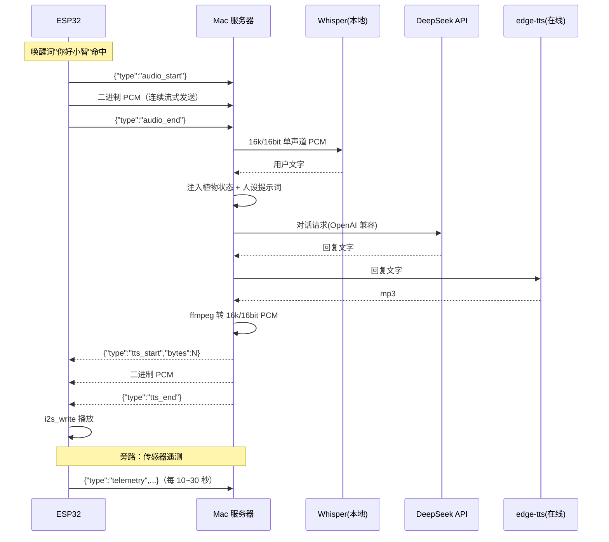

# PlantTalk 服务器端（Mac）项目规格

> 本 README 是 **Mac 服务器端新项目**的完整规格说明书。用它作为蓝本，在 Mac 上新建一个独立项目（例如 `planttalk-server/`），实现"语音识别 → 大模型对话 → 语音合成"的编排服务。
>
> ESP32 端只负责：**唤醒词检测（AFE）+ 录音上传（断句由神经 VAD 判定，抗背景音乐）+ 接收音频播放 + 传感器采集**。所有语音理解、对话、合成都在 Mac 端完成。

---

## 1. 项目定位

PlantTalk 是一个"植物陪伴 Agent"。用户对盆栽说唤醒词"你好小智"后开始说话，ESP32 把音频发给 Mac 服务器，服务器依次完成：

```
音频 → ASR(Whisper) → LLM(DeepSeek) → TTS(edge-tts) → 音频回传 → ESP32 播放
```

**服务器端对外只提供一个 WebSocket 服务**，同时支持两条辅助数据流：传感器遥测上报、设备控制下发。

---

## 2. 整体链路



---

## 3. 技术栈

| 模块 | 选型 | 说明 |
|------|------|------|
| 语言 | Python 3.11+ | |
| Web 框架 | FastAPI + uvicorn | 提供 WebSocket 端点 |
| ASR | faster-whisper（CTranslate2） | 本地免费；Apple Silicon 速度快；中文用 `initial_prompt` 提示 |
| LLM | DeepSeek `deepseek-chat` | OpenAI 兼容接口 |
| TTS | edge-tts | 免费、中文自然（`zh-CN-XiaoxiaoNeural`） |
| 音频转码 | ffmpeg（命令行 / pydub） | edge-tts 输出 mp3，需转 16k/16bit 单声道 PCM |

---

## 4. WebSocket 通信协议（重要，必须严格遵守）

- 端点：`ws://<Mac IP>:8765/ws`
- 音频规格：**16kHz / 16bit / 单声道 / little-endian PCM**，每样本 2 字节。
- 帧分两类：**文本帧 = JSON 控制消息**，**二进制帧 = 音频数据**。

### 4.1 ESP32 → 服务器

| 帧类型 | 内容 | 说明 |
|--------|------|------|
| 文本 | `{"type":"audio_start"}` | 开始上传一段用户语音 |
| 二进制 | PCM 字节 | 音频数据，可拆成多块连续发送 |
| 文本 | `{"type":"audio_end"}` | 语音结束，触发 ASR→LLM→TTS 流水线 |
| 文本 | `{"type":"telemetry","soil_moisture":23,"temp":26.5,"humidity":60,"light":4200}` | 传感器快照，服务器更新最新状态 |

### 4.2 服务器 → ESP32

| 帧类型 | 内容 | 说明 |
|--------|------|------|
| 文本 | `{"type":"text","user":"...","reply":"...","op":"none"}` | 回复文字；`op` 为 LLM 识别操作：`none`/`exit`/`volume_up`/`volume_down`，端侧按 op 分发 |
| 文本 | `{"type":"tts_start","bytes":N}` | 开始下发合成音频，N 为 PCM 字节总数 |
| 二进制 | PCM 字节 | 合成音频，可拆成多块 |
| 文本 | `{"type":"tts_end"}` | 音频结束，ESP32 完成播放 |
| 文本 | `{"type":"cmd","action":"pump","seconds":3}` | 控制指令（可选，二期） |
| 文本 | `{"type":"error","message":"..."}` | 出错提示 |

### 4.3 状态机约定

- 服务器收到 `audio_start` 后进入"收音频"状态，把后续二进制帧拼进缓冲区，直到收到 `audio_end`。
- 收到 `audio_end` 后串行执行 ASR → LLM → TTS，期间忽略新的 `audio_start`（或返回 busy）。
- 流水线完成后，先发 `tts_start`，再流式发送二进制音频，最后发 `tts_end`。
- LLM 回复带 `op` 操作字段（`none`/`exit`/`volume_up`/`volume_down`）；`exit` 时服务器下发道别音频，ESP32 播完回待唤醒（text 帧的 op 驱动，无额外帧）。
- LLM 不可用时兜底：ASR 文本命中退出词（`config.py` 的 `EXIT_WORDS`）同样走退出流程，用 `EXIT_REPLY` 固定道别。

---

## 5. 目录结构

```
planttalk-server/
├── README.md          # 本文件
├── requirements.txt   # 依赖
├── .env.example       # 环境变量模板
├── config.py          # 配置加载（端口、模型、DeepSeek key 等）
├── main.py            # FastAPI + WebSocket 入口、会话管理
├── protocol.py        # JSON 帧编解码 + 音频缓冲
├── asr.py             # faster-whisper 识别
├── llm.py             # DeepSeek 对话（OpenAI 兼容客户端）
├── tts.py             # edge-tts 合成 + ffmpeg 转码
├── plant_state.py     # 传感器最新快照存储（线程安全）
└── prompts.py         # 植物人设系统提示词模板
```

---

## 6. 环境准备

```bash
# 1) 创建虚拟环境
python3 -m venv .venv
source .venv/bin/activate

# 2) 安装依赖（见 requirements.txt）
pip install -r requirements.txt

# 3) 安装 ffmpeg（edge-tts 转码必需）
brew install ffmpeg

# 4) 配置 DeepSeek API Key
cp .env.example .env
# 编辑 .env，填入 DEEPSEEK_API_KEY
```

### requirements.txt 建议内容

```
fastapi
uvicorn[standard]
websockets
faster-whisper
openai
edge-tts
numpy
python-dotenv
pydub
```

---

## 7. 配置

`.env` 示例：

```env
# 服务监听端口（ESP32 连接 ws://<Mac IP>:8765/ws）
SERVER_PORT=8765

# DeepSeek
DEEPSEEK_API_KEY=sk-xxxx
DEEPSEEK_BASE_URL=https://api.deepseek.com
DEEPSEEK_MODEL=deepseek-chat

# ASR
WHISPER_MODEL=medium          # 可选 tiny/base/small/medium/large-v3
WHISPER_LANGUAGE=zh
WHISPER_INITIAL_PROMPT=以下是普通话的句子。

# TTS
TTS_VOICE=zh-CN-XiaoxiaoNeural
TTS_SAMPLE_RATE=16000         # 必须与 ESP32 播放端一致
```

---

## 8. 核心模块职责

### 8.1 `main.py`
- 创建 FastAPI 应用，注册 `@app.websocket("/ws")`。
- 每连接维护一个会话对象（音频缓冲、对话历史）。
- 收到 `audio_end` 后调用流水线：`asr → llm → tts`，并把结果按协议下发。
- 收到 `telemetry` 时更新 `plant_state`。

### 8.2 `asr.py`
```python
# 伪代码
def transcribe(pcm: bytes) -> str:
    audio = np.frombuffer(pcm, dtype=np.int16).astype(np.float32) / 32768.0
    segments, _ = model.transcribe(audio, language="zh",
                                   initial_prompt="以下是普通话的句子。")
    return "".join(s.text for s in segments).strip()
```

### 8.3 `llm.py`
- 使用 `openai` 客户端指向 DeepSeek：

```python
from openai import OpenAI
client = OpenAI(api_key=KEY, base_url="https://api.deepseek.com")
resp = client.chat.completions.create(
    model="deepseek-chat",
    messages=messages,          # system + 历史 + 当前用户
    temperature=0.8,
)
return resp.choices[0].message.content
```

- `messages` 的 system 部分由 `prompts.py` 生成，并动态注入 `plant_state` 的最新快照。

### 8.4 `tts.py`
```python
# 伪代码
import edge_tts
async def synthesize(text: str) -> bytes:
    tmp_mp3 = "/tmp/tts.mp3"
    await edge_tts.Communicate(text, "zh-CN-XiaoxiaoNeural").save(tmp_mp3)
    # ffmpeg 转 16k/16bit 单声道 PCM
    pcm = subprocess.run(
        ["ffmpeg","-y","-i",tmp_mp3,"-ar","16000","-ac","1","-f","s16le","pipe:1"],
        capture_output=True).stdout
    return pcm
```

### 8.5 `plant_state.py`
- 线程安全的字典，保存最新传感器快照；LLM 组提示词时读取。

---

## 9. 植物人设系统提示词（`persona.py` + `prompts.py`）

- `persona.py`：人设正文单独维护——紫色蝴蝶兰"紫姬"（外冷内热、轻微傲娇，含说话风格、关系成长、植物状态人格化表达等），改人设只动这个文件。
- `prompts.py`：`build_system_prompt(state)` 把「人设 + 当前植物状态 + 输出格式」拼成 system 提示词，要求 LLM 只输出 JSON `{"reply","operation"}`。

```python
# prompts.py
import persona

def build_system_prompt(state: dict) -> str:
    status = ""  # 由 state 生成（传感器未接入时为空，避免 LLM 编造数据）
    return persona.PERSONA + f"\n\n{status}\n" + "输出格式：只输出 JSON ..."
```

---

## 10. 运行

```bash
source .venv/bin/activate
uvicorn main:app --host 0.0.0.0 --port 8765
```

验证：ESP32 端把 WebSocket 地址填成 `ws://<Mac 局域网 IP>:8765/ws`。可用 `curl` 或浏览器控制台快速自测握手。

---

## 11. 后续扩展

- **打断**：ESP32 播放时检测到新语音 → 发 `{"type":"cancel"}` → 服务器停止下发并重新收音频。
- **主动提醒**：服务器定时任务（如每天早上）主动给 ESP32 推一段 TTS。
- **浇水控制**：LLM 输出结构化动作 → 服务器发 `{"type":"cmd","action":"pump","seconds":N}` → ESP32 驱动继电器。
- **语音克隆**：把 edge-tts 换成 CosyVoice 2 / GPT-SoVITS，得到专属音色。
- **音频压缩**：PCM 体积较大时，可引入 opus 编码降低带宽。

---

## 12. 与 ESP32 端的接口约定速查

| 项 | 约定 |
|----|------|
| 音频采样率 | 16000 Hz |
| 位深 | 16 bit |
| 声道 | 单声道 |
| 字节序 | little-endian |
| 上行开始/结束 | `audio_start` / `audio_end` |
| 下行开始/结束 | `tts_start` / `tts_end` |
| 传感器上报 | `telemetry` |
